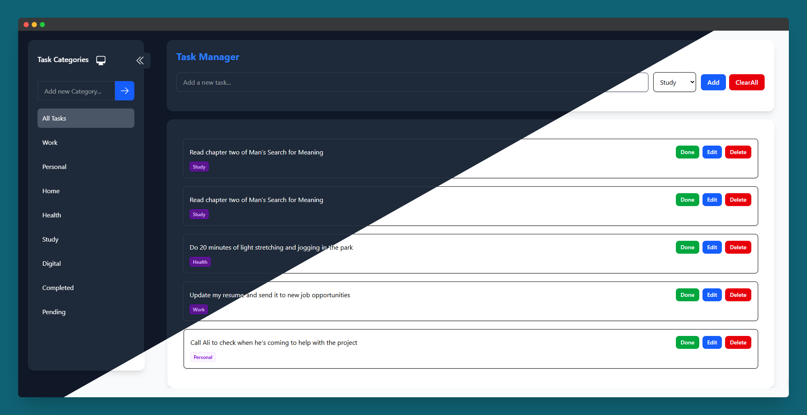

# 📝 Task Manager Web App

This is a simple and clean task management app built with React + Vite.  
You can create, edit, categorize, and manage your tasks with support for light/dark mode.

یک اپلیکیشن مدیریت وظایف با رابط کاربری زیبا، قابلیت دسته‌بندی وظایف، و تم تاریک و روشن.

---

## ⚙️ Features & Best Practices | ویژگی‌ها و رعایت اصول

- ✅ **Add / Edit / Delete** tasks  
- 🗂️ **Categorize tasks** (e.g. Work, Health, Study)  
- ➕ **Custom category creation**  
- 🎯 **Task status** toggle (Completed / Pending)  
- 🌓 **Dark / Light mode** with auto theme detection  
- 💾 **LocalStorage integration** for persistent data  
- 🧠 **Performance optimization** using `React.memo`, `useMemo`, `useCallback`  
- 🧩 **Modular component structure** for better scalability  
- 📱 **Responsive design** – works great on all screen sizes  

---

## 🧠 Tech Stack | تکنولوژی‌ها

- **React + Vite**
- **TailwindCSS**
- **Redux Toolkit** – for task and category state management
- **Zustand** – for alert state management

---

## 🖼️ Preview | پیش‌نمایش



---

## 🚀 How to Run

```bash
git clone https://github.com/ghorbanidev/todo-webapp.git
cd todo-webapp
npm install
npm run dev
```

---

## 👤 Developer

**Ali Ghorbani**  
[linkedin.com/in/alighorbanidev](https://linkedin.com/in/alighorbanidev)

---

## 📁 Project Structure

```
todo-webapp/
├── public/
├── src/
│   ├── assets/               # Static assets (images, icons)
│   ├── components/
│   │   ├── shared/           # Reusable shared components
│   │   ├── sidebar/          # Sidebar components
│   │   └── task/             # Task-related components
│   ├── features/             # Redux slices
│   ├── pages/                # App and task pages
│   ├── stores/               # Zustand alert store
│   └── main.jsx              # App entry
├── README.md
├── package.json
└── vite.config.js
```

---

> Made with ❤️ by Ali Ghorbani